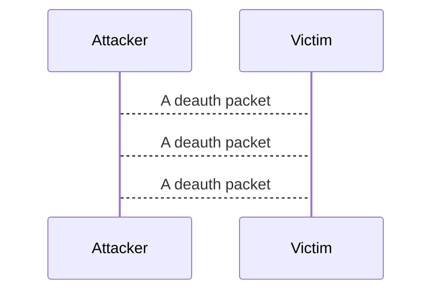
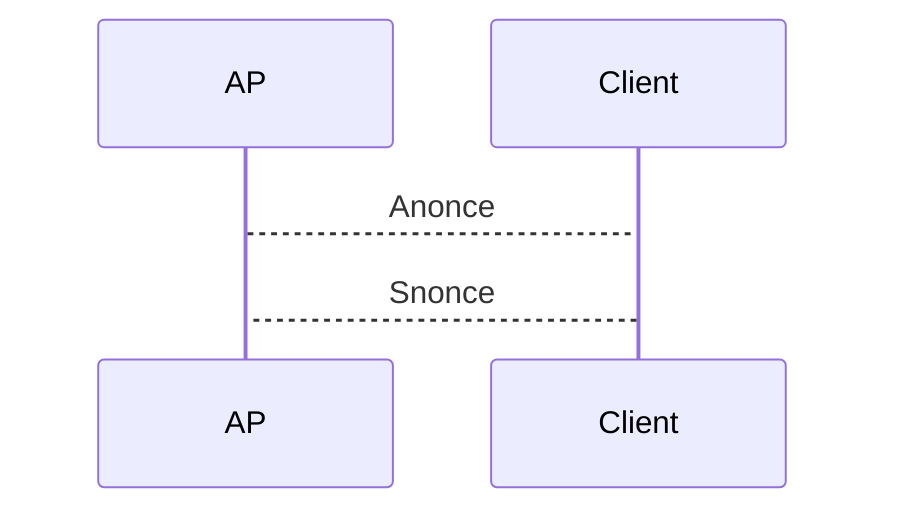

# wifi-cracker

This tool lets you select a wifi networtk, and gets an handshake for you.
You can use it in order to crack passwords or decrypting wifi network traffic.
The tool only gets you an handshake, you cnam odify it to do whatever you wants with it!.

## Step 1
A wifi networks scan, how it works:
Every wifi network is on a different frequency, which means we need to switch channel while sniffing **beacon frames**
We can switch the interface frqu like that:
```c
 struct iwreq wreq;

    int sock = socket(AF_INET,SOCK_DGRAM,0);
    if(sock == -1) {
        return -1;
    }

    memset(&wreq,0,sizeof(struct iwreq));
    strncpy(wreq.ifr_name,iface,strlen(iface));

    if(ioctl(sock,SIOCGIFFLAGS,&wreq) == -1) {
        return -1;
    }


    wreq.u.freq.m = freq;
    wreq.u.freq.e = 6; // Read about this on internet (:, it basicly 10 to the power of...

    if(ioctl(sock,SIOCSIWFREQ,&wreq) == -1) {
        close(sock);
        return -1;
    }
```
Remember that beacon frames arent "for us",
So in the hardware level the NIC ignores that, which means we need to apply **monitor mode**.
It will tell our NIC to not ignore any packet.

Thats how we can do it:

```c
    int sock = socket(AF_INET,SOCK_DGRAM,0);
    struct iwreq wreq;
    memset(&wreq,0,sizeof(struct iwreq));

    strncpy(wreq.ifr_name,iface,IFNAMSIZ);

    if(ioctl(sock,SIOCGIFFLAGS,&wreq) == -1){
        return -1;
    }

    wreq.u.mode = on ? IW_MODE_MONITOR : IW_MODE_INFRA;
    if(ioctl(sock,SIOCSIWMODE,&wreq) == -1){
        close(sock);
        return -1;
    }

    close(sock);
```

After sniffing a beacon frame you will need to extract the **SSID** and the **BSSID**
how? read about **iee 802.11 wifi protocol** and about the **frame control**

## Step 2

This will cause the victim machine to disconnect from the wifi network and **automaticly** reconnect.
you can read about the **deauthentication frame** to understand it better.

## Step 3
Now when the device will reconnect.
There is a 4way handshake


and the rest isnt matter now.

With the anonce and snonce you could do:
+ if you have the password you can make the encryption key of the client and decrypt its network traffic
+ you can try passwords untill you get the right one (offline bruteforce)

I didnt implement the next part which is do something with the handshake, you can do! :)
